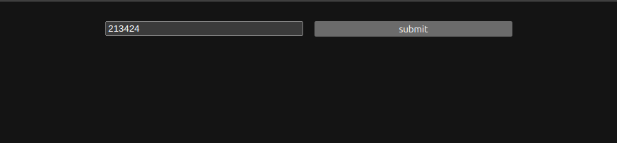
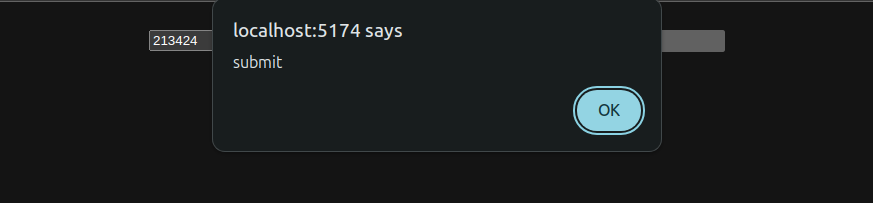
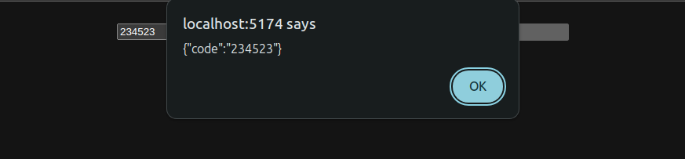
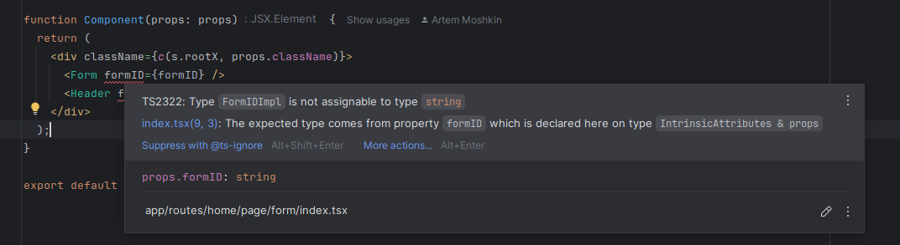
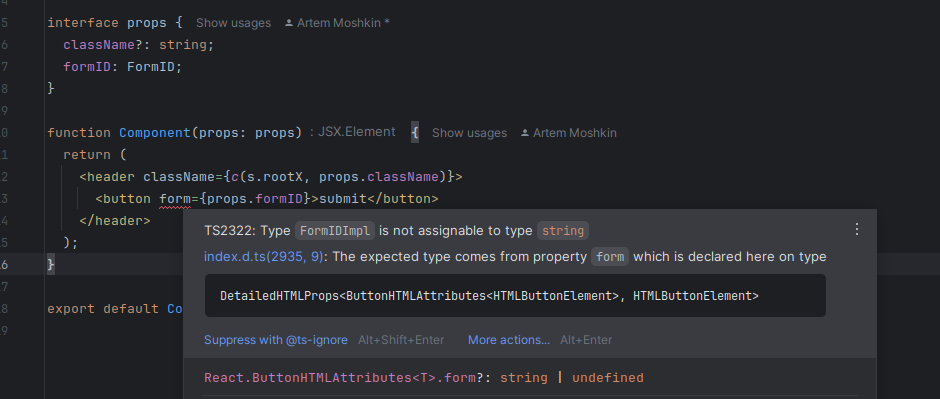
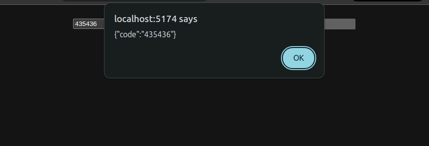

## Simple form
We have simple form - one field, one submit button. And everything is in one component.
[commit](https://github.com/PolyDevil/ed-forms/commit/45ee49e3009960122f173e741b562d38809b1dcf)

```tsx
<form>
    <input
        name="code"
        placeholder="123456 (code)"
        autoComplete="one-time-code"
        pattern="\d{6}"
        inputMode="numeric"
        minLength={6}
        maxLength={6}
        required
    />

    <button>submit</button>
</form>
```

Visually it looks like this:


Let's make sure that we can submit the form.
[commit](https://github.com/PolyDevil/ed-forms/commit/6b4d963162ba85908b41ec326312acdf88eb11bf)

```tsx
import type { FormEventHandler } from "react";

// ...

function Component(props: props) {
    const onSubmit: FormEventHandler<HTMLFormElement> = (event) => {
        event.preventDefault();
        alert("submit");
    };

    return (
        <form /* ... */ onSubmit={onSubmit}>
            {/* ... */}
        </form>
    );
}
```

After submitting the form we can see the result:


Now we want to show form values.
We can use the snippet:
```ts
const formdata = Object.fromEntries(new FormData(document.querySelector('form')))
```

So let's create a utility function
[commit](https://github.com/PolyDevil/ed-forms/commit/2538014a3c8728d38776ece6c20a560a3ced88d1)

```ts
// ./utils/form-data/index.ts
export default class FormdataImpl {
    static toObject<T>(node: HTMLFormElement) {
        return Object.fromEntries(new FormData(node)) as T;
    }
}
```

And don't forget to make an alias in `tsconfig.json`:
```json lines
    ...
    "paths": {
      ...
      "Formdata": ["./utils/form-data"]
    },
```

And we can show the result (also don't forget that `alert` takes a string, so we need to convert an object to a string):
[commit](https://github.com/PolyDevil/ed-forms/commit/4edb340e7e9c4238518d35a1a124083834cefc3e)

```tsx
// ...
import Formdata from "Formdata";

function Component(props: props) {
    const onSubmit: FormEventHandler<HTMLFormElement> = (event) => {
        event.preventDefault();
    
        if (!event.target) return;
    
        const formdata = Formdata.toObject<{ code: string }>(
            event.target as HTMLFormElement
        );
    
        alert(JSON.stringify(formdata));
    }
    // ...
```

Results:


But what if we will be forced to move our submit button of the form?
It is easy, if we use html.
https://developer.mozilla.org/en-US/docs/Web/HTML/Element/button#form

So as long as form's `id` attribute (`<form id={FormID}`>) and button's `form` attribute (`<button form={FormID}>`) have the same value, button will work as it is in the form.
[commit](https://github.com/PolyDevil/ed-forms/commit/ffbc576709f9b89233183cd008abde254d4d9ef8)

```tsx
const FormID = "form";

function Component(props: props) {
    return (
        <div>
            <form id={FormID} onSubmit={onSubmit}>
                <input {/* ... */} />
            </form>
    
            <button form={FormID}>submit</button>
        </div>
    );
}
```

And it works:


So we can move the button and the form into separate components:
[commit](https://github.com/PolyDevil/ed-forms/commit/501a8de676371bd9ee98c36687c74a382e9c78b8)

```tsx
// page/index.tsx
import c from "clsx";

import Header from "./header";
import Form from "./form";
import s from "./index.module.css";

interface props {
    className?: string;
}

const formID = "form";

function Component(props: props) {
    return (
        <div className={c(s.rootX, props.className)}>
            <Form formID={formID} />
            <Header formID={formID} />
        </div>
    );
}

export default Component;

// page/header/index.tsx
import c from "clsx";

import s from "./index.module.css";

interface props {
    className?: string;
    formID: string;
}

function Component(props: props) {
    return (
        <header className={c(s.rootX, props.className)}>
            <button form={props.formID}>submit</button>
        </header>
    );
}

export default Component;

// page/form/index.tsx
import type { FormEventHandler } from "react";
import c from "clsx";
import Formdata from "Formdata";

import s from "./index.module.css";

interface props {
    className?: string;
    formID: string;
}

function Component(props: props) {
    const onSubmit: FormEventHandler<HTMLFormElement> = (event) => {
        event.preventDefault();

        if (!event.target) return;

        const formdata = Formdata.toObject<{ code: string }>(
            event.target as HTMLFormElement
        );

        alert(JSON.stringify(formdata));
    };

    return (
        <form
            id={props.formID}
            onSubmit={onSubmit}
            className={c(s.rootX, props.className)}
        >
            <input
                name="code"
                placeholder="123456 (code)"
                autoComplete="one-time-code"
                pattern="\d{6}"
                inputMode="numeric"
                minLength={6}
                maxLength={6}
                required
            />
        </form>
    );
}

export default Component;
```

It works just the same as before:


But we need to define form's id in parent component and pass it to both components through props:
```tsx
const formID = "form";

function Component(props: props) {
    return (
        <div className={c(s.rootX, props.className)}>
            <Form formID={formID} />
            <Header formID={formID} />
        </div>
    );
}
```

And since it is just a string, there is no guarantee that we will pass the correct string.
We can use Branded types:
[commit](https://github.com/PolyDevil/ed-forms/commit/8938b06ddd7cd91abc764125a19bb66f585395f5)

```ts
// global.d.ts
// By declaring a unique symbol, we create a distinct marker in TypeScript.
declare const __brand: unique symbol;

declare global {
    // Define a Branded type that combines a base type with a brand
    type Branded<Type, Brand> = Type & {
        readonly [__brand]: Brand;
    };
}

export {};
```

And we need to create a class:
[commit](https://github.com/PolyDevil/ed-forms/commit/231cd28e6d2b375c7fd65ed140429d18fac479f1)

```ts
// utils/form-data/id.ts
class FormIDImpl {
    private readonly t: Branded<string, "FormID">;

    constructor(public s: string) {
        this.t = s as FormIDImpl["t"];
    }

    toString() {
        return this.t;
    }
}

export default FormIDImpl;


// utils/form-data/index.ts
// ...
export { default as FormID } from "./id";
```

Let's create a new global type - `FormID`:
```ts
// global.d.ts
import type { FormID as FormIDImpl } from "Formdata";
// ...

declare global {
    // ...
    type FormID = FormIDImpl;
}
```

Change our form id declaration:
```tsx
// ...
import { FormID } from "Formdata";

const formID = new FormID("form");

function Component(props: props) {
    return (
        <div className={c(s.rootX, props.className)}>
            <Form formID={formID} />
            <Header formID={formID} />
        </div>
    );
}
```

And we got an error: 


Now we need to change the props for `header` and `form` components:
```tsx
interface props {
    className?: string;
    formID: FormID; // it is global, no need to import anything
}
```

But there is still an error:


We need to explicitly call `.toString` method:
[commit](https://github.com/PolyDevil/ed-forms/commit/afc4256d1f8137a22a20d7447b1a35ce14043241)

```tsx
form={props.formID.toString()}
```

And the code works just like before:


But now we know how to:
 - convert form values into an object
 - move button out of the form
 - safely create branded data types that can safely consumed by agents we defined

Props:
 - framework-agnostic approach
 - no dependencies
 - better types
